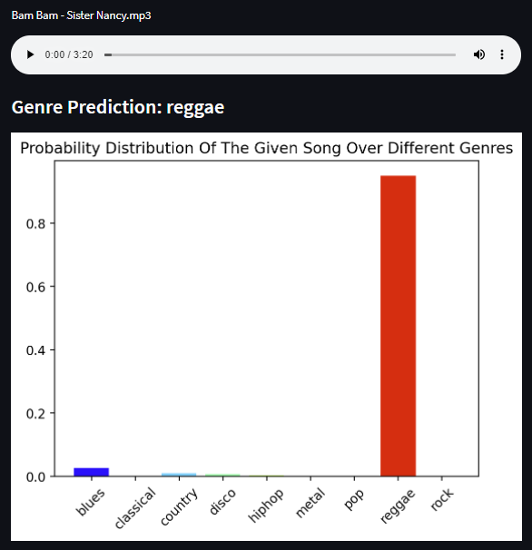
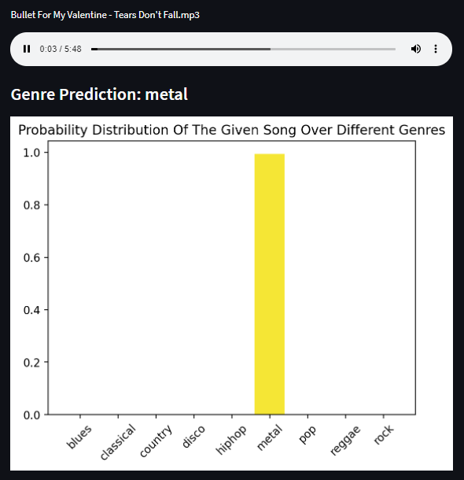
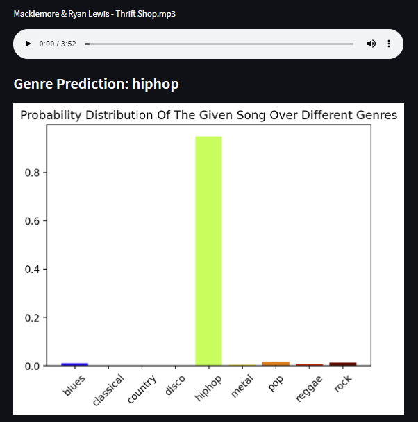
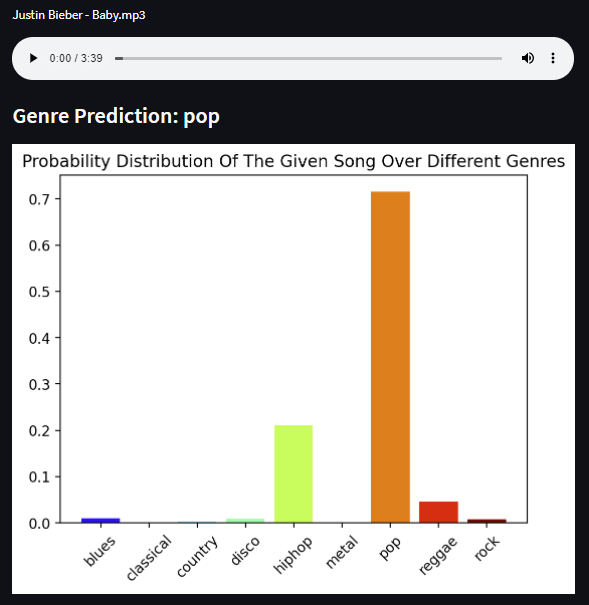
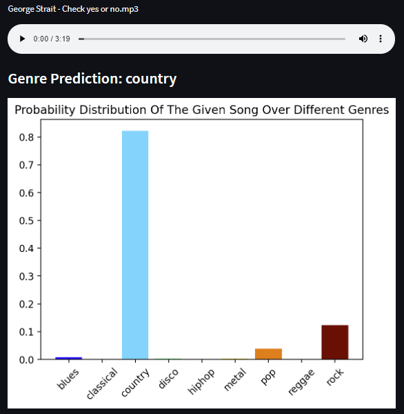
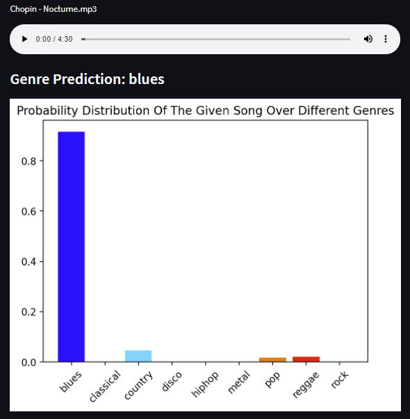
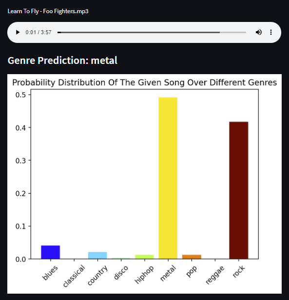

# Predicting the Genre of Music Samples without Extracting Audio Features using a Convolutional Neural Network

## Video Presentation on YouTube:

## Abstract
Classifying the genre of music is a necessary task for the purposes of organizing a music library and helping people discover the styles of music they find most enjoyable. While there are many methods of performing this classification process, there are many differences between methods, which lead to different results. Human classification is laborious, subject to bias, and impractical for companies like Spotify that need to classify massive datasets of audio files. This tedious process can instead be automated using machine learning techniques - from the analysis of extracted audio features using various classification models to the analysis of spectrogram images using convolutional neural networks (CNN). This article discusses the advantages and disadvantages of both methods, with bias towards optimizing the CNN model to avoid having to extract features from audio files and develop a labeled dataset prior to classification.
## Directory Structure
The data, genres_original, and audio_samples directories contain the FMA data, which is not uploaded to GitHub due to their size. The spectrograms directory fills up with files when running CNN_spectrogram_classifier.ipynb.

The CNN_spectrogram_classifier.ipynb file contains about 189 lines of code and is used for training and testing the CNN model on audio files.

The SVM_feature_classifier.ipynb files contains about 166 lines of code and is used for training and testing various machine learning classification models on audio feature data.

The app.py file is the web application and contains about 114 lines of code.

The CNNModelWeights.h5 is the saved weights for the trained CNN model, which is used by the Web Application to make predictions.

The requirements.txt file contains the command line arguments necessary to install all of the necessary packages to run the main program. The main program will automatically read this file and install any packages not already installed on your computer. You do not need to manually install these packages.

## Web App Usage
Install the packages found in requirements.txt. Than run the following command from this project's root directory.
$ streamlit run app.py

### Music Genre Classifier
### Example files with successful predictions:
##### Reggae: Bam Bam - Sister Nancy.mp3 

##### Disco: Bee Gees - Stayin' Alive .mp3

##### Metal: Bullet For My Valentine  - Tears Don't Fall.mp3

##### Hip Hop: Macklemore & Ryan Lewis - Thrift Shop.mp3

##### Pop: Justin Bieber - Baby.mp3

##### Country: George Strait - Check yes or no.mp3

### Example files with unsuccessful predictions:
##### Classical: Chopin - Nocturne.mp3 (Blues)

##### Rock: Learn To Fly - Foo Fighters.mp3 (Metal)

