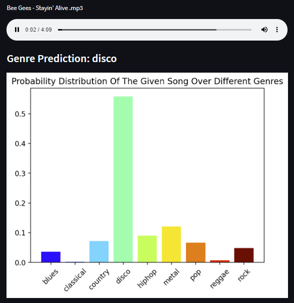

# Connect to the Amazon EC2 virtual machine:
##### $ ssh -i MusicGenreWebApp.pem ec2-user@ec2-18-216-42-105.us-east-2.compute.amazonaws.com
##### $ streamlit run app.py

# MusicGenreClassifier
### Example files with successful predictions:
##### Reggae: Bam Bam - Sister Nancy.mp3 

##### Disco: Bee Gees - Stayin' Alive .mp3

##### Metal: Bullet For My Valentine  - Tears Don't Fall.mp3

##### Hip Hop: Macklemore & Ryan Lewis - Thrift Shop.mp3

##### Pop: Justin Bieber - Baby.mp3

##### Country: George Strait - Check yes or no.mp3

### Example files with unsuccessful predictions:
##### Classical: Chopin - Nocturne.mp3 (Blues)

##### Rock: Learn To Fly - Foo Fighters.mp3 (Metal)

Room to Improve: Blues and Classical often get misclassified.